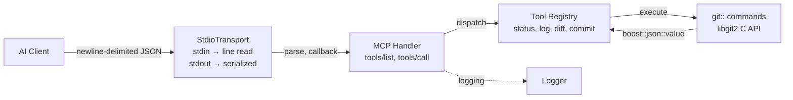
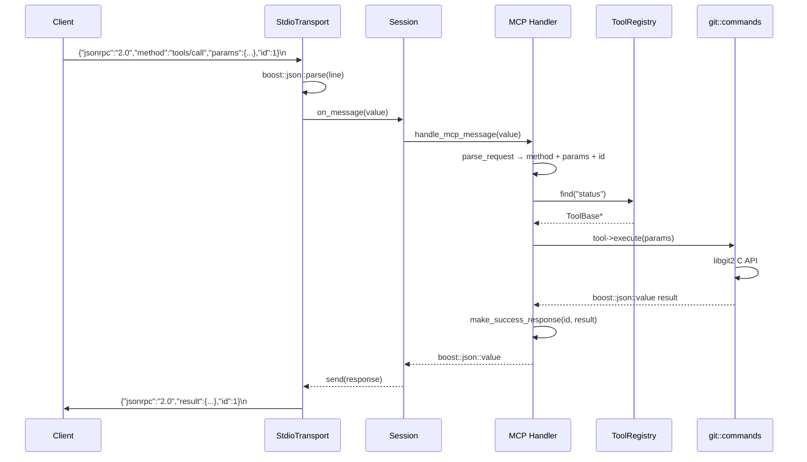

# DEV.md — GitPilot Developer Guide

## Architecture

GitPilot is a C++20 MCP server. AI clients send JSON-RPC 2.0 requests over
stdin; the server dispatches them to Git tools backed by libgit2.



### Request lifecycle



---

## Server Endpoints (MCP Methods)

### `tools/list`

Returns all registered tool definitions with their JSON Schema input schemas.

**Request:**

```json
{"jsonrpc": "2.0", "id": 1, "method": "tools/list"}
```

**Response:** `result.tools` array of `{name, description, inputSchema}` objects.
See [DEV_IN_DEPTH.md](DEV_IN_DEPTH.md#tools) for full schemas.

**Side effects:** None.

### `tools/call`

Execute a tool by name with the supplied arguments.

**Request:**

```json
{
  "jsonrpc": "2.0",
  "id": 1,
  "method": "tools/call",
  "params": {
    "name": "status",
    "arguments": {"repo_path": "."}
  }
}
```

**Success response:**

```json
{
  "jsonrpc": "2.0",
  "id": 1,
  "result": {
    "content": [{"type": "text", "text": "{\"files\": [...]}"}]
  }
}
```

**Error response codes:**

| Code   | Meaning          | When                                 |
| ------ | ---------------- | ------------------------------------ |
| -32700 | Parse error      | Invalid JSON on stdin                |
| -32600 | Invalid Request  | Missing `jsonrpc: "2.0"` or `method` |
| -32601 | Method not found | Unknown method string                |
| -32602 | Invalid params   | Missing/unknown tool name, bad args  |
| -32603 | Internal error   | Tool execution threw exception       |

**Side effects:** `commit` writes to the git repository.

---

## Tools

| Tool     | Required params        | Optional params                                                   | Returns            |
| -------- | ---------------------- | ----------------------------------------------------------------- | ------------------ |
| `status` | `repo_path`            | —                                                                 | `{files: [...]}`   |
| `log`    | `repo_path`            | `max_count` (int, default 10), `branch` (string, default "HEAD")  | `{commits: [...]}` |
| `diff`   | `repo_path`            | `target` (string, default "HEAD"), `staged` (bool, default false) | `{patch: "..."}`   |
| `commit` | `repo_path`, `message` | `author_name`, `author_email` (strings)                           | `{hash, message}`  |

If `author_name`/`author_email` are omitted, empty strings are passed to
libgit2. `GitActor::from_config()` exists as a static method but is not
currently called by any tool. An empty signature causes a libgit2 error.

---

## Concurrency

- **Stdio mode**: single-threaded. `StdioTransport::run()` blocks on
  `std::getline()`. Only one request is processed at a time.
- **HTTP mode**: single-threaded infinite accept loop. No per-connection
  session handling or concurrency is implemented.
- **No rate limiting, queuing, or worker pools** exist.

---

## Build System

```sh
cmake --preset debug                   # configure (build/debug)
cmake --build --preset debug           # build
build/debug/src/git_pilot_server      # run
```

The `git_pilot_core` target is an **OBJECT library** — object files compile once
and link directly into `git_pilot_server` without an intermediate archive.

### Build presets

| Preset          | Generator  | Binary dir            | Notes                                           |
| --------------- | ---------- | --------------------- | ----------------------------------------------- |
| `debug`         | Ninja      | `build/debug`         | ASan+UBSan, `-O0`, timestamps + source location |
| `release`       | Ninja      | `build/release`       | `-O3`, timestamp only                           |
| `xcode-debug`   | Xcode      | `build/xcode-debug`   | macOS only, arm64+x86_64                        |
| `xcode-release` | Xcode      | `build/xcode-release` | macOS only                                      |
| `vs-debug`      | VS 17 2022 | `build/vs-debug`      | Windows only                                    |
| `vs-release`    | VS 17 2022 | `build/vs-release`    | Windows only                                    |

### Compile-time options

| CMake Option               | Default | Effect                                       |
| -------------------------- | ------- | -------------------------------------------- |
| `LOG_SHOW_TIME_STAMP`      | ON      | Timestamp `[HH:MM:SS.ffffff]` per log line   |
| `LOG_SHOW_SOURCE_LOCATION` | OFF     | Source `[file:line:function]` per log line   |
| `LOG_USE_FMT`              | OFF     | Use `fmt::vformat` instead of `std::vformat` |
| `ENABLE_HTTP`              | ON      | Build HTTP transport source                  |
| `ENABLE_STDIO`             | ON      | Build stdio transport source (always on)     |
| `BUILD_TESTS`              | ON      | Enable CTest (no tests registered yet)       |

---

## Repo Layout

```
include/git_pilot/       Active namespace — tools, utils (logger)
include/git_mcp/         Protocol/transport namespace — types, handler, session, transport
src/
  main.cpp               Entry point (CLI, dispatch to stdio or HTTP mode)
  server.cpp             HTTP TCP acceptor (skeleton)
  session.cpp            Wires transport → handler → response
  protocol/types.cpp     JSON-RPC 2.0 parse/serialize
  protocol/mcp_handler.cpp  tools/list, tools/call dispatch
  transport/stdio_transport.cpp  stdin/stdout line-based transport
  tools/tool_registry.cpp  Singleton registry, registers 4 tools
  tools/git_status/log/diff/commit.cpp  Concrete tool implementations
  git/                   RAII wrappers + git commands (status/log/diff/commit)
  utils/logger.cpp       Logger implementation
  utils/*.cpp            3 empty stubs (error_handling, json_helpers)
  tools/*.cpp            7 empty stubs (clone, add, branches, checkout, merge, show, branch_create)
  git/ops/*.cpp          9 empty stubs (decomposed operations)
  protocol/json_rpc.cpp  Empty (types live in types.cpp)
  transport/http_transport.cpp  Empty stub
cmake/                   CompilerOptions.cmake, project_config.hpp.in
config/                  Empty (not yet implemented)
tests/                   6 empty test stubs (unit/ + integration/), no CTest registration
```

---

## Coding Conventions

- **Format**: tabs (4-space width), ColumnLimit 100, `PointerAlignment: Right`,
  `ReferenceAlignment: Pointer`. Run `clang-format -i <file>`.
- **Lint**: `.clang-tidy` enables `readability-*`, `modernize-*`, `bugprone-*`,
  `misc-*` checks.
- **EditorConfig**: tab indent for C/C++, space indent for CMake.
- **Namespaces**: `git_pilot::tools`, `git_pilot::git`, `git_pilot::utils` for
  implementation. `git_mcp::protocol`, `git_mcp::transport` for MCP layer.
- **Doxygen required**: all public interfaces must include `@brief`, `@param`,
  `@return`, `@throws`, `@file`, `@author`, `@date`, `@version`.

---

## Testing

No test framework is integrated. Six empty test stubs exist under `tests/`
(4 unit, 2 integration). `tests/CMakeLists.txt` is a comment-only placeholder.
`ctest --preset all` reports zero tests.

---

## Logging

For the full API reference, see `include/git_pilot/utils/logger.hpp` and
[DEV_IN_DEPTH.md](DEV_IN_DEPTH.md#logger).

```cpp
Logger::instance().init("", LogLevel::Debug);           // stderr
Logger::instance().init("/var/log/git_pilot.log", ...); // file
```

**Macros**: `LOG_FATAL`, `LOG_ERROR`, `LOG_WARN`, `LOG_INFO`, `LOG_DEBUG`,
`LOG_TRACE`, `LOG_PERROR`, `LOG_AT`. Each guards with `is_level_enabled()`
before evaluating arguments — zero cost when disabled.

**Thread safety**: `mutex_` guards output; `min_level_` is `std::atomic` —
lock-free for level checks.

---

## Known Limitations

- **No MCP lifecycle handshake** — `initialize`/`initialized` is not implemented
- **No Content-Length framing** — stdio transport uses newline-delimited JSON
- **HTTP mode is a skeleton** — accepts TCP connections and closes them immediately
- **No tests** — test stubs exist but are empty, no CTest registration
- **7 tool stubs** — `clone`, `add`, `checkout`, `merge`, `show`, `branches`, `branch_create` are empty
- **Config subsystem** — `config/` is empty
- **`temp/` directory** — contains 25 scratch stub files (not built)
- **`use_color()` acquires mutex** — trivial bool getter takes the logger mutex
