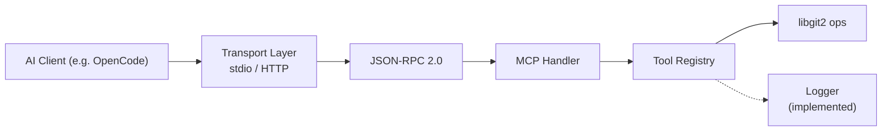
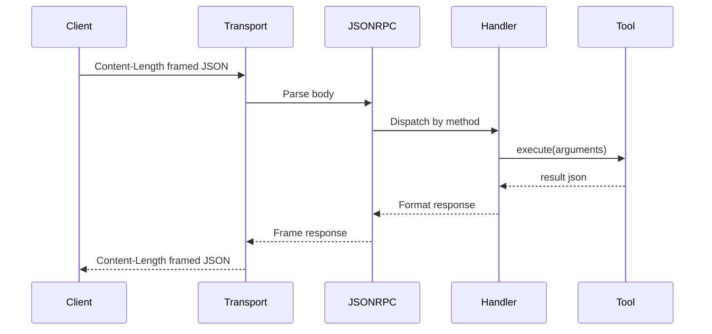

# DEV.md — GitPilot Developer Guide

## Architecture

GitPilot implements MCP so AI clients can call Git operations through a
standardized tool interface.



Currently implemented: `Logger`. Everything else is planned (source stubs exist).

### Request lifecycle (planned)

1. Client sends Content-Length framed JSON-RPC 2.0 over stdin or HTTP
2. Transport reads the frame, parses JSON body
3. JSON-RPC dispatches by method: `initialize`, `tools/list`, `tools/call`
4. MCP Handler validates and routes to Tool Registry
5. Tool Registry looks up the tool and calls `execute(json)`
6. Tool performs Git operation via libgit2, returns JSON-RPC response



## Build system

CMake 4.4.0+, C++20, Ninja (default) or Xcode. Presets in `CMakePresets.json`:

| Preset          | Generator | Binary dir            |
| --------------- | --------- | --------------------- |
| `debug`         | Ninja     | `build/debug`         |
| `release`       | Ninja     | `build/release`       |
| `xcode-debug`   | Xcode     | `build/xcode-debug`   |
| `xcode-release` | Xcode     | `build/xcode-release` |

```sh
cmake --preset debug                 # configure
cmake --build --preset debug         # build (zero warnings)
build/debug/src/git_pilot_server     # run
```

The `git_pilot_core` target is an **OBJECT library** — all `.o` files link
directly into `git_pilot_server` without an intermediate `.dylib`.

### Remaining build issues

- **nlohmann/json** — used by `tool_base.hpp` but not declared via
  `find_package` in CMake. Found via system include path on the developer's
  machine. Add `find_package(nlohmann_json REQUIRED)` to `CMakeLists.txt` when
  formalizing the dependency.
- **No test targets** — `tests/CMakeLists.txt` is empty. Unit/integration test
  stubs exist under `tests/` but have no CTest registration.

### Dependencies

| Library                               | Required | Used by              |
| ------------------------------------- | -------- | -------------------- |
| Boost (system, json, program_options) | Yes      | Transport, JSON, CLI |
| libgit2                               | Yes      | Git operations       |
| Threads                               | Yes      | Logger mutex         |
| nlohmann/json                         | Yes*     | Tool interface       |

\* Not declared in CMake — see build issues above.

Boost.Asio and Boost.Beast are not direct dependencies (header-only; used only
if HTTP transport is implemented).

## Repo layout

```
include/
  git_pilot/              Active headers
    utils/logger.hpp        Logger class + macros
    tools/tool_base.hpp     ToolBase abstract interface
    sample.hpp              Scaffolding (stub)
    sample_1.hpp            Scaffolding duplicate (stub)
  git_mcp/                Empty placeholder namespace (18 stub headers)
src/
  main.cpp                Entry point (logger demo)
  server.cpp / session.cpp  Empty stubs
  utils/logger.cpp        Logger implementation (237 lines)
  utils/*.cpp             3 empty stubs
  tools/*.cpp             6 empty stubs (tool_registry + 5 git tools)
  protocol/*.cpp          3 empty stubs
  transport/*.cpp         3 empty stubs
cmake/
  CompilerOptions.cmake   Shared compiler flags
config/                   Empty stubs
tests/
  CMakeLists.txt          Empty (0 bytes)
  unit/                   4 empty test stubs
  integration/            2 empty test stubs
```

## Coding conventions

- **Format**: tabs (4-space width), ColumnLimit 100, `PointerAlignment: Right`,
  `ReferenceAlignment: Pointer`. Run `clang-format -i <file>`.
- **Lint**: `.clang-tidy` enables readability-_, modernize-_, bugprone-_,
  misc-_ checks.
- **EditorConfig**: tab indent for C/C++, space indent for CMake.
- **Namespace**: `git_pilot::utils`, `git_pilot::tools`. The `git_mcp` namespace
  is an empty placeholder.
- **Doxygen required**: all public interfaces must include `@brief`, `@param`,
  `@return`, `@throws`, `@file`, `@author`, `@date`, `@version`.

## Logging

Singleton at `git_pilot::utils::Logger::instance()`. Writes to **stderr** by
default; optionally to a file.

```cpp
Logger::instance().init("", LogLevel::Debug);              // stderr (default)
Logger::instance().init("/var/log/git_pilot.log", ...);    // file
```

### Macros

| Macro        | Level | Notes                     |
| ------------ | ----- | ------------------------- |
| `LOG_FATAL`  | Fatal | Bright bold red           |
| `LOG_ERROR`  | Error | Bold red                  |
| `LOG_WARN`   | Warn  | Bold yellow               |
| `LOG_INFO`   | Info  | Bold green                |
| `LOG_DEBUG`  | Debug | Bold cyan                 |
| `LOG_TRACE`  | Trace | Bold magenta              |
| `LOG_PERROR` | Error | Appends `strerror(errno)` |

Each macro guards with `is_level_enabled()` **before** evaluating
`source_location::current()` or formatting arguments. Disabled log calls are
zero-cost.

### Compile-time flags

| Flag                       | Effect                                       |
| -------------------------- | -------------------------------------------- |
| `LOG_SHOW_TIME_STAMP`      | Timestamp `[HH:MM:SS.ffffff]` per line       |
| `LOG_SHOW_SOURCE_LOCATION` | Source `[file:line:function]` per line       |
| `LOG_USE_FMT`              | Use `fmt::vformat` instead of `std::vformat` |
| `ENABLE_HTTP`              | Build HTTP transport                         |
| `ENABLE_STDIO`             | Build stdio transport                        |

Source locations are project-relative at compile time via
`-fmacro-prefix-map=${CMAKE_SOURCE_DIR}/=` (defined in
`cmake/CompilerOptions.cmake`).

### Thread safety

- `mutex_` guards all output writes and stream/state mutations.
- `min_level_` is `std::atomic<LogLevel>` — `is_level_enabled()` is lock-free.
- No per-line flush — buffered I/O for throughput.

## Tool interface

Abstract base in `include/git_pilot/tools/tool_base.hpp` — namespace
`git_pilot::tools`:

```
ToolBase
 ├── get_definition() -> ToolDefinition
 ├── execute(json) -> json
 └── validate_arguments(json) -> bool

ToolDefinition
 ├── name, description, parameters
 └── to_json_schema() -> json schema

ToolParameter
 ├── name, type, description, required
 └── schema (nlohmann::json)
```

Concrete tool stubs (all empty): `git_clone`, `git_status`, `git_commit`,
`git_log`, `git_diff`.

## Testing

Not yet implemented. Test stubs exist at `tests/unit/` (4 files) and
`tests/integration/` (2 files). No CTest registration.

For implementation internals see [DEV_IN_DEPTH.md](DEV_IN_DEPTH.md).
