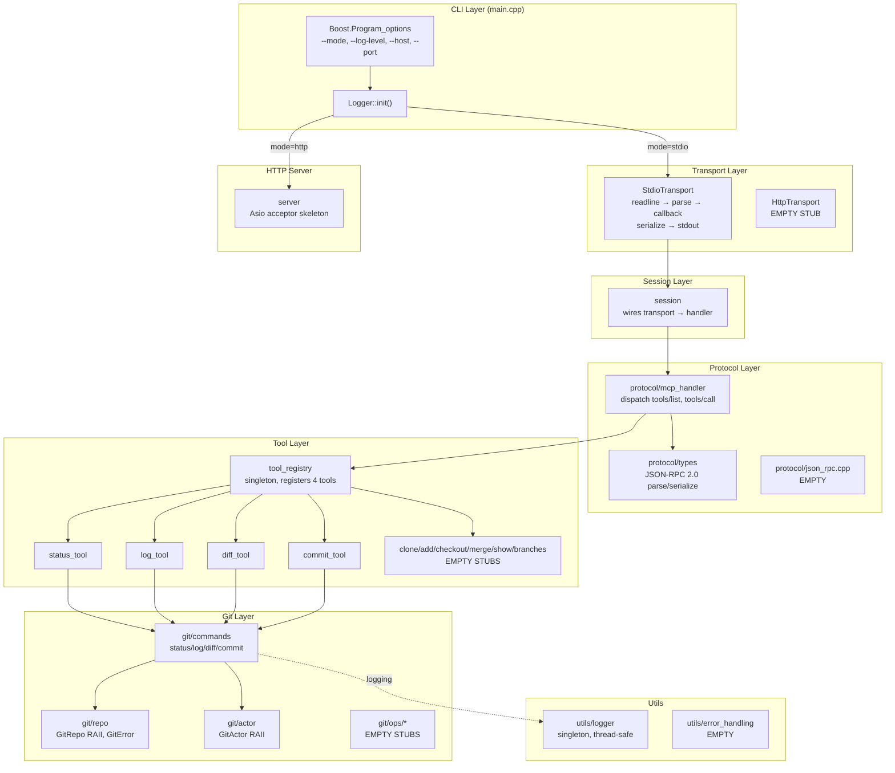
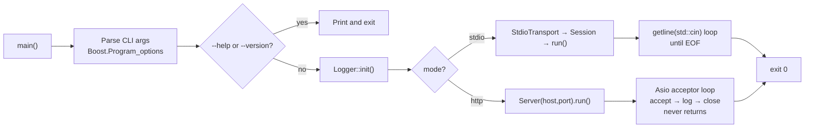
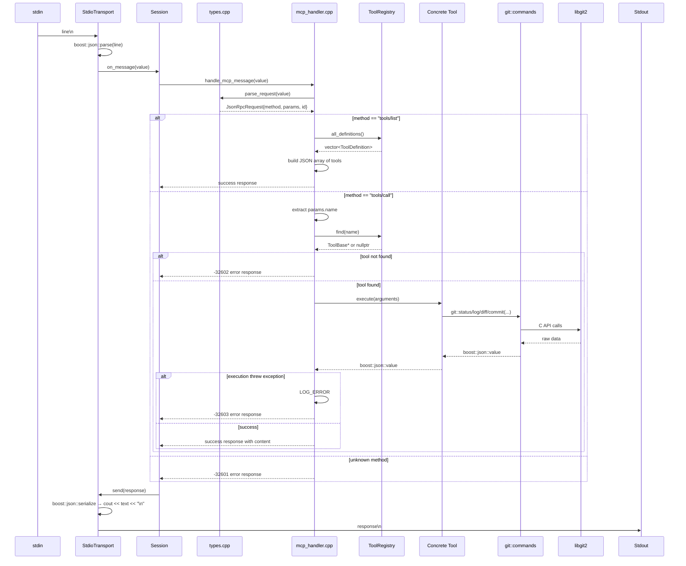
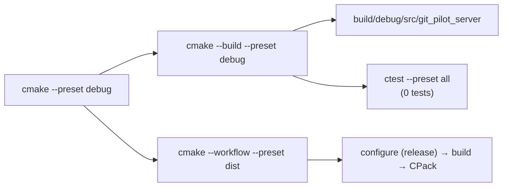
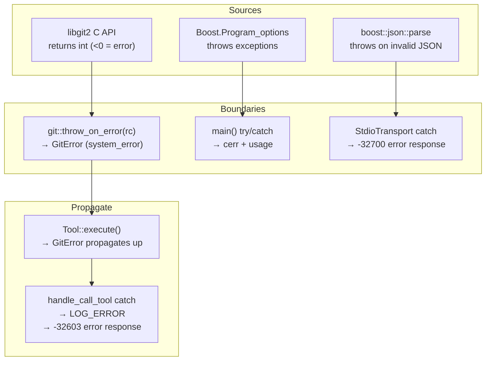

# DEV_IN_DEPTH.md — GitPilot Implementation Guide

## 1. Project Overview

GitPilot is a C++20 MCP server that exposes Git operations as JSON-RPC 2.0
callable tools. It uses Boost.JSON for all JSON handling, libgit2 for Git
operations, and Boost.Program_options for CLI argument parsing. Two namespace
trees coexist: `git_pilot` (tools, git, utils) and `git_mcp` (protocol,
transport, server, session).

The MCP lifecycle handshake (`initialize`/`initialized`) is **not**
implemented. The stdio transport uses newline-delimited JSON rather than the
standard `Content-Length:` framing.

---

## 2. Complete Architecture



### 2.1 Namespace Map

| Namespace            | Location                     | Role                                                 | Status |
| -------------------- | ---------------------------- | ---------------------------------------------------- | ------ |
| `git_pilot::utils`   | `include/git_pilot/utils/`   | Logger                                               | DONE   |
| `git_pilot::tools`   | `include/git_pilot/tools/`   | ToolBase, ToolRegistry, 4 concrete tools             | DONE   |
| `git_pilot::git`     | `src/git/`                   | GitRepo, GitActor, commands (status/log/diff/commit) | DONE   |
| `git_mcp::protocol`  | `include/git_mcp/protocol/`  | JSON-RPC types, MCP handler                          | DONE   |
| `git_mcp::transport` | `include/git_mcp/transport/` | Transport base, StdioTransport                       | DONE   |
| `git_mcp`            | `include/git_mcp/`           | Session, Server                                      | DONE   |
| `config`             | `config/`                    | Server config                                        | EMPTY  |

---

## 3. Execution Flow



### 3.1 Stdio mode details

```
main()
  ├── create StdioTransport (unique_ptr)
  ├── create Session(std::move(transport))
  ├── session.run()
  │     ├── LOG_INFO("Session started")
  │     ├── transport->run(callback)
  │     │     ├── while running_ && getline(cin, line):
  │     │     │     ├── empty → continue
  │     │     │     ├── try: msg = boost::json::parse(line)
  │     │     │     │         callback(msg) → on_message
  │     │     │     │           ├── response = handle_mcp_message(msg)
  │     │     │     │           └── transport->send(response)
  │     │     │     │               ├── text = boost::json::serialize(response)
  │     │     │     │               └── cout << text << "\n" << flush
  │     │     │     └── catch parse_error:
  │     │     │           send JSON-RPC -32700 error
  │     │     └── running_ = false (on EOF or close())
  │     └── LOG_INFO("Session ended")
  └── return EXIT_SUCCESS
```

### 3.2 HTTP mode details

```
main()
  ├── determine host (default "0.0.0.0"), port (default "8080")
  ├── LOG_INFO("starting in HTTP mode")
  ├── Server(host, port).run()
  │     ├── io_context
  │     ├── tcp::acceptor(io_context, tcp::endpoint(address, port))
  │     ├── LOG_INFO("listening on host:port")
  │     └── for (;;)
  │           ├── tcp::socket socket(io_context)
  │           ├── acceptor.accept(socket)
  │           ├── LOG_INFO("accepted from remote_ip")
  │           └── socket.close()
  └── (never reaches here)
```

---

## 4. Control Flow: Request Lifecycle



---

## 5. Source Tree Walkthrough

```
include/
  git_pilot/                        Active namespace — real headers
    utils/logger.hpp                  Logger class + macros (242 lines)
    tools/tool_base.hpp               ToolBase, ToolParameter, ToolDefinition (52 lines)
    tools/tool_registry.hpp           ToolRegistry declaration (30 lines)
    sample.hpp                        Stub, not referenced by any code
  git_mcp/                          Protocol/transport namespace (mixed state)
    protocol/
      types.hpp                       JsonRpcRequest/Response/Error structs, parse/make helpers (39 lines)
      mcp_handler.hpp                 handle_mcp_message() declaration (9 lines)
      json_rpc.hpp                    EMPTY (0 bytes)
    transport/
      transport.hpp                   Transport abstract base, MessageCallback typedef (21 lines)
      stdio_transport.hpp             StdioTransport class (20 lines)
      http_transport.hpp              EMPTY (0 bytes)
    server.hpp                        Server class (24 lines)
    session.hpp                       Session class (23 lines)
    tools/                            7 headers — ALL EMPTY (0 bytes each)
    utils/                            3 headers — ALL EMPTY (0 bytes each)

src/
  main.cpp                          133 lines — CLI, modal dispatch
  server.cpp                         40 lines — Asio TCP acceptor skeleton
  session.cpp                        30 lines — wires transport → handler → response
  protocol/
    types.cpp                        86 lines — JSON-RPC 2.0 parse/serialize
    mcp_handler.cpp                  95 lines — tools/list, tools/call dispatch
    json_rpc.cpp                     EMPTY (not used; namesake in types.cpp)
  transport/
    stdio_transport.cpp              54 lines — stdin readline loop, parse, write
    http_transport.cpp               EMPTY
    transport.cpp                    Include-only (abstract base needs no impl)
  tools/
    tool_registry.cpp                51 lines — singleton, registers 4 tools
    git_status.cpp                   35 lines — StatusTool
    git_log.cpp                      45 lines — LogTool
    git_diff.cpp                     45 lines — DiffTool
    git_commit.cpp                   48 lines — CommitTool
    git_clone.cpp                    EMPTY
    git_add.cpp, git_branch_create.cpp, git_branches.cpp, git_checkout.cpp,
      git_merge.cpp, git_show.cpp    ALL EMPTY (6 files)
  git/
    repo.hpp                         94 lines — GitError, GitRepo (git_repository* RAII)
    repo.cpp                          8 lines — libgit2 static init
    actor.hpp                        88 lines — GitActor (git_signature* RAII)
    actor.cpp                        Comment-only (header-only class)
    commands.hpp                     24 lines — cmd declarations
    commands.cpp                    261 lines — status/log/diff/commit via libgit2
    handle.cpp                       EMPTY
    ops/                             9 files — ALL EMPTY (decomposed ops)
  utils/
    logger.cpp                      256 lines — logger implementation
    json_helpers.cpp                 EMPTY
    error_handling.cpp               EMPTY

cmake/
  CompilerOptions.cmake              Compiler/linker flags (Wall, Wextra, Wshadow, sanitizers)
  project_config.hpp.in              Config header template (version, no LOG defines)

config/                              EMPTY — CMakeLists.txt is a comment placeholder

tests/
  CMakeLists.txt                     Comment placeholder — no add_test() calls
  unit/                              4 files — ALL EMPTY
  integration/                       2 files — ALL EMPTY

temp/                                Scratch directory, 25 empty stub files — NOT BUILT
```

---

## 6. Module Docs

<a name="logger"></a>

### 6.1 Logger (`git_pilot::utils::Logger`)

**File**: `include/git_pilot/utils/logger.hpp` (header + templates),
`src/utils/logger.cpp` (implementation)

**Design**: Meyers singleton (`static Logger reg;` in `instance()`).
Two-tier implementation: variadic forwarding templates in the header
type-erase via `make_format_args()` and call non-template `log_impl()` /
`log_perror_impl()` in the `.cpp`.

```mermaid
flowchart LR
    Macro["LOG_INFO('hello {}', name)"] --> G["is_level_enabled(Info)?"]
    G -->|no| Z["nothing (zero cost)"]
    G -->|yes| SL["source_location::current()"]
    SL --> T["log(level, fmt, loc, args...) [inline template]"]
    T --> TE["make_format_args(args...) → format_args"]
    TE --> I["log_impl(level, fmt, loc, format_args) [.cpp]"]
    I --> VF["vformat(fmt, args) → string"]
    VF --> WE["write_log_entry(level, msg, loc)"]
    WE --> L["lock_guard(mutex_)"]
    L --> TS["timestamp[if LOG_SHOW_TIME_STAMP]"]
    TS --> C["color codes[if terminal]"]
    C --> SL2["source location[if LOG_SHOW_SOURCE_LOCATION]"]
    SL2 --> O["*output_stream_ << msg"]
```



**Key design decisions:**

- **Macro guard**: `is_level_enabled()` evaluates before
  `source_location::current()` and args. Disabled calls are zero-cost
  (`do { if (false) } while(0)`).
- **Type-erased formatting**: only one instantiation of the format+write path
  per severity level, not per call site.
- **No per-line flush**: buffered I/O for throughput.
- **Color**: ANSI escape codes when `isatty()`. Fatal=bright bold red,
  Error=bold red, Warn=bold yellow, Info=bold green, Debug=bold cyan,
  Trace=bold magenta.
- **Relative source paths**: `-fmacro-prefix-map=${CMAKE_SOURCE_DIR}/=` in
  `CompilerOptions.cmake` rewrites `__FILE__` / `source_location::file_name()`.

**Compile flags:**

| Flag                       | Effect                              | Default |
| -------------------------- | ----------------------------------- | ------- |
| `LOG_SHOW_TIME_STAMP`      | `[HH:MM:SS.ffffff]` prefix          | ON      |
| `LOG_SHOW_SOURCE_LOCATION` | `[file:line:function]` suffix       | OFF     |
| `LOG_USE_FMT`              | `fmt::vformat` → `fmt::format_args` | OFF     |

**Thread safety:**

- `mutex_` (`std::mutex`) guards all writes and state mutations.
- `min_level_` (`std::atomic<LogLevel>`) — `is_level_enabled()` is lock-free.
- Constructor/destructor not thread-safe; call `init()` once at startup.

**Known issue**: `use_color()` acquires the logger mutex even though it only
reads a `bool` set once during `init()`.

### 6.2 ToolBase (`git_pilot::tools::ToolBase`)

**File**: `include/git_pilot/tools/tool_base.hpp`

**Types:**

```cpp
struct ToolParameter {
    std::string      name;          // parameter key
    std::string      type;          // "string", "integer", "boolean"
    std::string      description;
    bool             required = false;
    boost::json::value schema;     // JSON Schema fragment
};

struct ToolDefinition {
    std::string                 name;
    std::string                 description;
    std::vector<ToolParameter>  parameters;

    boost::json::value to_json_schema() const;
};

class ToolBase {
    virtual ~ToolBase() = default;
    virtual ToolDefinition get_definition() const = 0;
    virtual boost::json::value execute(const boost::json::value &arguments) = 0;
    virtual bool validate_arguments(const boost::json::value &args) const;
};
```

**JSON library**: Uses `boost::json::value` / `boost::json::object` /
`boost::json::array` throughout. No trace of `nlohmann/json`.

### 6.3 ToolRegistry (`git_pilot::tools::ToolRegistry`)

**File**: `include/git_pilot/tools/tool_registry.hpp`, `src/tools/tool_registry.cpp`

- Meyers singleton.
- Constructor registers 4 tools by calling factory functions:
  `create_status_tool()`, `create_log_tool()`, `create_diff_tool()`,
  `create_commit_tool()`.
- `find(name)` returns `ToolBase*` (nullptr if not found).
- `all_definitions()` collects `get_definition()` from every registered tool.

<a name="tools"></a>

### 6.4 Tools

All implementations live in `src/tools/git_*.cpp`. Each exposes a factory
function returning `std::unique_ptr<ToolBase>`.

| Tool   | Factory function       | Source file            | Lines |
| ------ | ---------------------- | ---------------------- | ----- |
| status | `create_status_tool()` | `tools/git_status.cpp` | 35    |
| log    | `create_log_tool()`    | `tools/git_log.cpp`    | 45    |
| diff   | `create_diff_tool()`   | `tools/git_diff.cpp`   | 45    |
| commit | `create_commit_tool()` | `tools/git_commit.cpp` | 48    |

Each tool class is `final`, inherits from `ToolBase`, and delegates to the
corresponding `git::` command function. No tool performs validation beyond
what `boost::json::value::at()` provides.

### 6.5 Git Layer (`git_pilot::git`)

#### GitRepo (`src/git/repo.hpp`)

RAII wrapper for `git_repository*`. Opens via `git_repository_open_ext()`
with `GIT_REPOSITORY_OPEN_FROM_ENV`. Deleted copy, move-only.
Provides `ptr()`, `path()`, `is_bare()`, `is_empty()`, `operator bool()`.

#### GitError (`src/git/repo.hpp`)

Inherits `std::system_error`. Constructs with libgit2 error code and
`git_error_last()->message`. `throw_on_error(rc)` helper throws `GitError`
when `rc < 0`.

#### GitActor (`src/git/actor.hpp`)

RAII wrapper for `git_signature*`. Creates via `git_signature_now()`.
Static `from_config(const GitRepo&)` reads `user.name`/`user.email` from
the repository's git config and constructs a `GitActor`. Returns
`std::nullopt` if either config key is missing.

#### Git Commands (`src/git/commands.cpp`, 261 lines)

All functions return `boost::json::value`. Internal helpers (anonymous
namespace): `oid_to_hex()` (manual hex formatting), `resolve_rev()`
(parse revision string via `git_revparse_single`), RAII deleters for
`git_object`, `git_diff`, `git_revwalk`, `git_tree`, `git_commit`.

**`status(repo_path)`:**

- `git_status_foreach_ext` with `GIT_STATUS_OPT_INCLUDE_UNTRACKED` +
  `GIT_STATUS_OPT_RENAMES_HEAD_TO_INDEX`
- Callback builds a `boost::json::object` per file with `path`,
  `index_status`, `worktree_status`, `ignored`, `conflicted`
- Returns `{"files": [...]}`

**`log(repo_path, max_count=10, branch="HEAD")`:**

- `git_revwalk_new`, sort by `GIT_SORT_TIME | GIT_SORT_TOPOLOGICAL`
- Push start OID from `resolve_rev()`
- Iterate up to `max_count` commits
- Per commit: hash, author_name, author_email, committer_name, committer_email,
  timestamp, message
- Returns `{"commits": [...]}`

**`diff(repo_path, target="HEAD", staged=false)`:**

- Resolves target to commit → tree
- Staged: `git_diff_tree_to_index(head_tree, nullptr, opts)` (was fixed to pass
  5 args including nullptr opts)
- Unstaged: `git_diff_tree_to_workdir(head_tree, nullptr)`
- Renders to string via `git_diff_to_buf(GIT_DIFF_FORMAT_PATCH)`
- Returns `{"patch": "..."}`

**`commit(repo_path, message, author_name, author_email)`:**

- `git_repository_index` → `git_index_write_tree` → `git_tree_lookup`
- Resolves HEAD parent via `git_reference_name_to_id`
- `git_commit_create_v` with the author/committer signature and tree
- Returns `{"hash": "...", "message": "..."}`

#### libgit2 initialization (`src/git/repo.cpp`)

```cpp
struct GitInit {
    GitInit() { git_libgit2_init(); }
    ~GitInit() { git_libgit2_shutdown(); }
};
```

Static file-scope initializer ensures libgit2 is initialized before any
`GitRepo` is constructed.

### 6.6 JSON-RPC Protocol (`git_mcp::protocol`)

**Types** (`include/git_mcp/protocol/types.hpp`, `src/protocol/types.cpp`):

```cpp
struct JsonRpcRequest { std::string method; boost::json::value params; boost::json::value id; };
struct JsonRpcError { int code; std::string message; std::optional<boost::json::value> data; };
struct JsonRpcResponse { boost::json::value id; std::optional<boost::json::value> result; std::optional<JsonRpcError> error; };
```

**`parse_request(msg)`:**

- Validates `jsonrpc == "2.0"`, extracts `method`, `params`, `id`
- Returns `std::nullopt` if validation fails → caller sends -32600 error

**Response helpers:**

- `make_success_response(id, result)` → `{"jsonrpc":"2.0","result":...,"id":n}`
- `make_error_response(code, msg, id)` → `{"jsonrpc":"2.0","error":{...},"id":n}`

### 6.7 MCP Handler (`git_mcp::protocol::handle_mcp_message`)

**File**: `src/protocol/mcp_handler.cpp`

Call chain:

1. `parse_request(request)` → `JsonRpcRequest`
2. Switch on `method`:
   - `"tools/list"` → `handle_list_tools(id)` → queries `ToolRegistry::all_definitions()`, builds response
   - `"tools/call"` → `handle_call_tool(params, id)` → extracts tool name, calls `ToolRegistry::find()`, executes tool, wraps result in MCP content format
   - unknown method → -32601 error

**Result wrapping**: tool results are serialized to string and placed in
MCP content format:

```json
{"content": [{"type": "text", "text": "{\"files\": [...]}"}]}
```

### 6.8 StdioTransport (`git_mcp::transport::StdioTransport`)

**File**: `src/transport/stdio_transport.cpp`

- **Read**: `std::getline(std::cin, line)` — reads until `\n` or EOF.
  Empty lines are skipped. JSON parsing via `boost::json::parse(line)`.
- **Write**: `boost::json::serialize(msg)` → `std::cout << text << "\n" << std::flush`.
- **Framing**: newline-delimited JSON (one JSON object per line). No
  `Content-Length:` header.
- **Error**: parse failures send `{"code": -32700, "message": "Parse error"}`.
- **Shutdown**: loop exits when `std::cin` returns EOF (pipe closes) or
  `close()` sets `running_ = false`.

### 6.9 Session (`git_mcp::Session`)

**File**: `src/session.cpp`

Wires a Transport to the MCP handler. `run()` calls `transport->run(callback)`
where `on_message` calls `handle_mcp_message` and sends the response back
through the transport.

### 6.10 Server (`git_mcp::Server`)

**File**: `src/server.cpp`

Basic Asio TCP acceptor:

```cpp
asio::io_context io_ctx;
auto endpoint = asio::ip::tcp::endpoint(asio::ip::make_address(host_), port);
asio::ip::tcp::acceptor acceptor(io_ctx, endpoint);
for (;;) {
    asio::ip::tcp::socket socket(io_ctx);
    acceptor.accept(socket);
    LOG_INFO("Accepted connection from {}", socket.remote_endpoint().address().to_string());
    socket.close();
}
```

Accepts connections and immediately closes them. No request processing,
no session creation. The HTTP mode is a skeleton.

---

## 7. Data Flow

```
stdin (text line)
  │
  ▼
StdioTransport
  │ boost::json::parse(line)
  ▼
boost::json::value
  │
  ▼
Session::on_message(msg)
  │
  ▼
MCP Handler::handle_mcp_message(msg)
  │
  ├─► JSON-RPC parse_request
  ├─► method dispatch
  │     │
  │     ├─► tools/list → ToolRegistry::all_definitions()
  │     │     └─► ToolBase::get_definition() per tool
  │     │
  │     └─► tools/call → ToolRegistry::find(name)
  │           └─► ToolBase::execute(arguments)
  │                 └─► git::command(repo_path, ...)
  │                       └─► libgit2 C API
  │                             └─► raw data → boost::json::value
  │
  └─► make_success_response / make_error_response
        │
        ▼
boost::json::value (response JSON)
  │
  ▼
StdioTransport::send(response)
  │ boost::json::serialize
  ▼
stdout (text line)
```

---

## 8. Configuration Mechanisms

- **CLI**: Boost.Program_options parses `main()`'s `argc`/`argv`. Options:
  `--mode`, `--log-level`, `--log-file`, `--host`, `--port`, `--help`,
  `--version`.
- **CMake options**: `LOG_SHOW_TIME_STAMP`, `LOG_SHOW_SOURCE_LOCATION`,
  `LOG_USE_FMT`, `ENABLE_HTTP`, `ENABLE_STDIO`, `BUILD_TESTS` — set via
  `cmake -D` or preset.
- **Generated config header**: `cmake/project_config.hpp.in` →
  `build/<preset>/include/git_pilot/project_config.hpp` with
  `GITPILOT_VERSION_MAJOR`, `GITPILOT_VERSION_MINOR`,
  `GITPILOT_VERSION_PATCH`, `GITPILOT_VERSION` (string).
- **`config/` subsystem**: not implemented — `CMakeLists.txt` and
  `server_config.cpp` are empty.

---

## 9. Build Pipeline



**Root CMakeLists.txt order:**

1. Require CMake 4.4.0, C++20
2. Options: BUILD_TESTS, ENABLE_HTTP, ENABLE_STDIO, LOG_*
3. `include(CompilerOptions)` from `cmake/`
4. `find_package`: Boost (system, json, program_options), libgit2, Threads
5. `configure_file` → `project_config.hpp`
6. `add_subdirectory(src)` — creates `git_pilot_core` OBJECT library
7. Set LOG compile definitions on `git_pilot_core`
8. Optionally `find_package(fmt)` and link
9. Optionally `add_subdirectory(tests)`
10. Install `git_pilot_server` binary + public headers

**src/CMakeLists.txt:**

- `add_library(git_pilot_core OBJECT <sources>)` — no standalone artifact
- Transport compile defs: `ENABLE_HTTP=1`, `ENABLE_STDIO=1` (PRIVATE)
- Links: `Boost::system`, `Boost::json`, `Boost::program_options`,
  `libgit2::libgit2package`, `Threads::Threads` (PUBLIC); `${CMAKE_DL_LIBS}` (PRIVATE)
- `add_executable(git_pilot_server $<TARGET_OBJECTS:git_pilot_core>)`
- Compiler+linker options from `CompilerOptions.cmake`

**CompilerOptions.cmake:**

- Non-MSVC: `-Wall -Wextra -Wpedantic -Wshadow -Wconversion -Wno-missing-field-initializers`
- Debug: `-g3 -O0 -fsanitize=address -fsanitize=undefined -fstack-usage`
- Release: `-O3 -DNDEBUG`
- All: `-fmacro-prefix-map=${CMAKE_SOURCE_DIR}/=`
- MSVC: `/W4 /permissive- /utf-8`, Debug: `/Od /Zi`, Release: `/O2 /DNDEBUG`

---

## 10. Runtime Model

- **Stdio mode**: single-threaded, blocking I/O on stdin. One request at a time.
  No async/event loop.
- **HTTP mode**: single-threaded, blocking Asio acceptor. No per-connection
  session handling.
- **No worker pools, no thread pools, no async processing.**
- The logger is the only component designed for multi-threaded access (mutex
  guard).

---

## 11. Error Propagation



- **libgit2 errors**: `throw_on_error(rc)` converts negative return codes to
  `GitError` (`std::system_error` subclass with `git_error_last()->message`).
- **Tool execution errors**: caught in `handle_call_tool()`, logged, returned
  as JSON-RPC -32603.
- **JSON parse errors**: caught in `StdioTransport::run()`, returned as -32700.
- **CLI errors**: caught in `main()`, printed to stderr with usage, exit 1.
- **Logger format errors**: caught internally, outputs `[FORMAT ERROR]`.

---

## 12. Memory Ownership / Object Lifetimes

- **ToolRegistry**: Meyers singleton — lives for program duration.
- **StdioTransport**: owned by `Session` via `unique_ptr<Transport>`.
- **Session**: stack-allocated in `main()` — lives for one stdio session.
- **Tools**: owned by `ToolRegistry` via `unordered_map<string, unique_ptr<ToolBase>>`.
  Registered once during static initialization.
- **GitRepo / GitActor**: stack-allocated or RAII-managed per command call.
  No cross-call state — each `git::command()` opens its own repo.
- **Logger stream**: `ostream*` points to `std::cerr` or an `ofstream` member
  owned by the Logger. File stream closed in Logger destructor.
- **No shared_ptr anywhere** in the implemented code.

---

## 13. External Dependencies

| Dependency             | Why It Exists                                    | CMake          |
| ---------------------- | ------------------------------------------------ | -------------- |
| Boost.System           | Error code type for Boost dependencies           | `find_package` |
| Boost.JSON             | All JSON-RPC message serialization, tool schemas | `find_package` |
| Boost.Program_options  | CLI argument parsing                             | `find_package` |
| libgit2                | Native Git repository access for all commands    | `find_package` |
| Threads (`std::mutex`) | Logger mutex                                     | `find_package` |
| fmt (optional)         | Alternative format backend for logger            | `find_package` |

Boost.Asio and Boost.Beast are available header-only but not directly linked.
Asio is used in `server.cpp`.

---

## 14. Known Limitations (From Source)

1. **No MCP lifecycle handshake** — `initialize`/`initialized` not implemented.
2. **No Content-Length framing** — stdio uses newline-delimited JSON, not the
   MCP standard `Content-Length: N\r\n` framing.
3. **HTTP mode is a skeleton** — accepts connections, logs, closes immediately.
   No message handling.
4. **No tests** — 6 test stubs exist, all empty. `tests/CMakeLists.txt` has no
   `add_test()` calls. CTest reports zero tests.
5. **7 tool stubs** — `clone`, `add`, `checkout`, `merge`, `show`, `branches`,
   `branch_create` are empty.
6. **`git/ops/` — 9 empty stubs** — intended decomposition of commands into
   per-operation files, not used.
7. **Config subsystem empty** — `config/` is a comment-only CMakeLists.txt and
   an empty `server_config.cpp`.
8. **`json_rpc.cpp` + `json_rpc.hpp`** — both are empty. JSON-RPC types live
   in `types.cpp`/`types.hpp` instead.
9. **`use_color()` acquires mutex** — trivial bool getter unnecessarily locks.
10. **`sample.hpp`** — unreferenced stub in `include/git_pilot/`.
11. **`temp/` directory** — 25 scratch stub files, not part of the build.
12. **Duplicate `include/git_mcp/` headers** — 12 zero-byte headers exist as
    placeholders alongside 6 real headers.
13. **`include/git_mcp/utils/logger.hpp`** — empty (the real logger is in
    `include/git_pilot/utils/logger.hpp`).
14. **`@file log.hpp`** — wrong filename in `logger.hpp` Doxygen comment.
15. **Server::run() infinite loop** — no shutdown mechanism.
16. **Session not wired in HTTP mode** — `session.cpp` is stdio-only.
