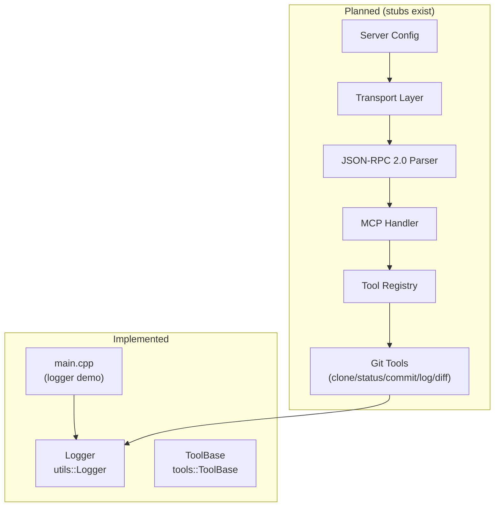
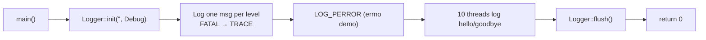
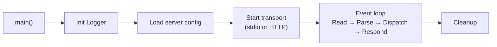
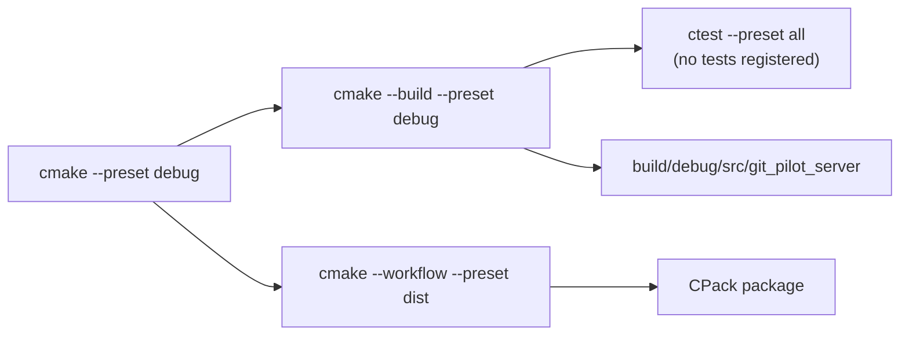

# DEV_IN_DEPTH.md — GitPilot Implementation Guide

## 1. Project overview

GitPilot is a C++20 MCP (Model Context Protocol) server that exposes Git
operations as callable tools. It is early-stage: the logging subsystem, tool
abstraction base class, and build pipeline are implemented. Everything else
— transport, protocol, session management, tool implementations, tests —
exists as file stubs containing no real code.

The canonical namespace is `git_pilot`. A parallel `git_mcp` namespace exists
with empty placeholder headers and is not used by any implementation code.

## 2. Complete architecture



### 2.1 Implemented subsystems

**Logger** (`git_pilot::utils::Logger`) — thread-safe singleton. Outputs to
stderr by default, optionally to a file. ANSI color with bold level labels on
terminal. Configurable log levels, optional timestamps and source location via
compile definitions. Format engine defaults to `std::vformat`; can use
`fmt::vformat` when `LOG_USE_FMT` is defined. See module deep-dive below.

**ToolBase** (`git_pilot::tools::ToolBase`) — abstract interface for all Git
tools. Concrete tools (`git_clone`, `git_status`, `git_commit`, `git_log`,
`git_diff`) exist as empty source files. `ToolRegistry` is also an empty stub.

**main.cpp** — logger smoke-test: initializes with stderr at Debug level, logs
one message per level, tests perror output, and runs 10 threads to demonstrate
thread safety. No server or stdin processing.

### 2.2 Stub subsystems (planned)

| Subsystem      | Source files                    | Role                                                        |
| -------------- | ------------------------------- | ----------------------------------------------------------- |
| Transport      | `transport/transport.cpp`       | Abstract transport interface                                |
| StdioTransport | `transport/stdio_transport.cpp` | Read/write Content-Length framed JSON-RPC over stdin/stdout |
| HttpTransport  | `transport/http_transport.cpp`  | HTTP transport                                              |
| JSON-RPC       | `protocol/json_rpc.cpp`         | Parse/serialize JSON-RPC 2.0 messages                       |
| MCP Handler    | `protocol/mcp_handler.cpp`      | Dispatch MCP methods to tools                               |
| Types          | `protocol/types.cpp`            | JSON-RPC message types                                      |
| ToolRegistry   | `tools/tool_registry.cpp`       | Register and look up tools by name                          |
| Git tools      | `tools/git_*.cpp` (5 files)     | Execute Git operations via libgit2                          |
| Server         | `server.cpp` / `session.cpp`    | Server lifecycle and per-connection session                 |
| Config         | `config/server_config.cpp`      | Server configuration loading                                |

## 3. Execution flow (current)



1. `main()` calls `Logger::instance().init("", LogLevel::Debug)` — stderr at
   Debug verbosity.
2. Logs one message per severity level (FATAL through TRACE) with format args.
3. Opens a nonexistent file to trigger `LOG_PERROR`.
4. Spawns 10 threads, each logging a hello/goodbye pair with a 10 ms sleep,
   then joins them.
5. Calls `Logger::instance().flush()` and exits with code 0.

### Execution flow (planned server)



## 4. Control flow: log message lifecycle

```mermaid
flowchart LR
    Macro["LOG_INFO('hello {}', name)"] --> Guard["is_level_enabled(Info)?"]
    Guard -- no --> Return["nothing (zero cost)"]
    Guard -- yes --> SL["source_location::current()"]
    SL --> Fwd["log() template (forwarding)"]
    Fwd --> TE["make_format_args(args...)<br/>(type-erased)"]
    TE --> Impl["log_impl(level, fmt, loc, format_args)"]
    Impl --> VF["vformat(fmt, args) → string"]
    VF --> WE["write_log_entry(level, msg, loc)"]
    WE --> Lock["lock_guard(mutex_)"]
    Lock --> TS["timestamp[?]"]
    TS --> Color["color codes (if terminal)"]
    Color --> Src["source location[?]"]
    Src --> Out["*output_stream_ << msg"]
    Out --> Unlock["~lock_guard()"]
```



Key design choices:

- **Macro-level guard**: `is_level_enabled()` is evaluated **before**
  `source_location::current()` and all arguments. Disabled log calls are
  zero-cost — the compiler sees only a `do { if (false) } while(0)`.
- **Tiny forwarding template**: `log()` and `log_perror()` are minimal inline
  templates that only call `make_format_args(args...)` (where `args` are named
  lvalues) and forward to the non-template `log_impl`/`log_perror_impl`. The
  compiler inlines these entirely; code bloat is limited to the
  `make_format_args` call itself.
- **Type-erased formatting**: `log_impl` receives `std::format_args` (or
  `fmt::format_args`), so only one instantiation of the format + write path
  exists.
- **No per-line flush**: `write_log_entry` does not call `flush()` after each
  line. I/O is buffered for throughput.

## 5. Source tree walkthrough

```
include/git_pilot/        — real headers
  utils/
    logger.hpp              — Logger class, LogLevel enum, log macros (~238 lines)
  tools/
    tool_base.hpp           — ToolBase, ToolDefinition, ToolParameter
  sample.hpp                — duplicate Sample class (stub, no impl)
  sample_1.hpp              — identical duplicate (stub, no impl)

include/git_mcp/          — empty placeholder headers (18 files, 0 bytes each)
  protocol/                 — json_rpc.hpp, mcp_handler.hpp, types.hpp
  tools/                    — 7 tool headers (mirrors git_pilot layout)
  transport/                — transport.hpp, stdio_transport.hpp, http_transport.hpp
  utils/                    — logger.hpp, error_handling.hpp, json_helpers.hpp
  server.hpp, session.hpp

src/                      — implementation
  main.cpp                  — entry point (logger demo, 40 lines)
  CMakeLists.txt            — OBJECT library + executable definition
  server.cpp                — empty stub
  session.cpp               — empty stub
  utils/
    logger.cpp              — Logger implementation (248 lines, fully implemented)
    json_helpers.cpp        — empty stub
    error_handling.cpp      — empty stub
  tools/
    tool_registry.cpp       — empty stub
    git_clone.cpp           — empty stub
    git_status.cpp          — empty stub
    git_commit.cpp          — empty stub
    git_log.cpp             — empty stub
    git_diff.cpp            — empty stub
  protocol/
    json_rpc.cpp            — empty stub
    mcp_handler.cpp         — empty stub
    types.cpp               — empty stub
  transport/
    transport.cpp           — empty stub
    stdio_transport.cpp     — empty stub
    http_transport.cpp      — empty stub

cmake/
  CompilerOptions.cmake     — shared compiler flags (Wall, Wextra, Wpedantic,
                              debug/release flags, -fmacro-prefix-map)

config/                     — empty stubs
tests/
  CMakeLists.txt            — empty (0 bytes)
  unit/                     — 4 empty test stubs
  integration/              — 2 empty test stubs
scripts/                    — empty stubs (currently unused)
docs/                       — empty stubs (currently unused)
```

## 6. Module deep-dive: Logger

### Design decisions

- **Singleton** — any TU can log without owning a reference. Access via
  `Logger::instance()`.
- **Two-tier implementation** — `log()` and `log_perror()` are variadic
  forwarding templates (inline in header) that immediately type-erase via
  `make_format_args()` and forward to non-template `log_impl`/
  `log_perror_impl` in the `.cpp`. This keeps template bloat minimal while
  giving call sites a clean variadic interface.
- **Macro guard** — every `LOG_*` macro wraps in
  `do { if (is_level_enabled(...)) ... } while(0)`. The level check protects
  against evaluating `source_location::current()` and formatting arguments
  when the log level is disabled.
- **Thread safety** — a `std::mutex` guards output and file state. The
  minimum log level is `std::atomic<LogLevel>` so `is_level_enabled()` is
  lock-free on the hot path.
- **Color** — ANSI escape codes when output is a terminal (`isatty`). All
  level labels are rendered bold. Fatal is bright bold red, Error bold red,
  Warn bold yellow, Info bold green, Debug bold cyan, Trace bold magenta.
- **Relative source paths** — `-fmacro-prefix-map=${CMAKE_SOURCE_DIR}/=` is
  set in `cmake/CompilerOptions.cmake`. The compiler rewrites `__FILE__` /
  `source_location::file_name()` at compile time, so log output shows
  project-relative paths (e.g. `src/main.cpp`) with zero runtime cost.

### Internal API

| Method / Macro                     | Kind            | Defined in | Notes                                                           |
| ---------------------------------- | --------------- | ---------- | --------------------------------------------------------------- |
| `instance()`                       | static          | logger.cpp | Singleton access                                                |
| `init(string_view, LogLevel)`      | public          | logger.cpp | `""` = stderr, any string = file path                           |
| `set_level(LogLevel)`              | public          | logger.cpp | Atomic store                                                    |
| `get_level()`                      | public          | logger.cpp | Atomic load                                                     |
| `is_level_enabled(LogLevel)`       | public          | logger.cpp | Lock-free (`atomic` load + compare)                             |
| `use_color()`                      | public          | logger.cpp | Acquires mutex                                                  |
| `flush()`                          | public          | logger.cpp | Flushes output stream                                           |
| `log(level, fmt, loc, args...)`    | public template | logger.hpp | Forwarding → `log_impl`                                         |
| `log_perror(fmt, loc, args...)`    | public template | logger.hpp | Forwarding → `log_perror_impl`                                  |
| `LOG_FATAL(fmt, ...)`              | macro           | logger.hpp | Guarded, passes `source_location::current()`                    |
| `LOG_ERROR(fmt, ...)`              | macro           | logger.hpp | Guarded                                                         |
| `LOG_WARN(fmt, ...)`               | macro           | logger.hpp | Guarded                                                         |
| `LOG_INFO(fmt, ...)`               | macro           | logger.hpp | Guarded                                                         |
| `LOG_DEBUG(fmt, ...)`              | macro           | logger.hpp | Guarded                                                         |
| `LOG_TRACE(fmt, ...)`              | macro           | logger.hpp | Guarded                                                         |
| `LOG_PERROR(fmt, ...)`             | macro           | logger.hpp | Guarded, calls `log_perror`                                     |
| `log_impl(level, fmt, loc, args)`  | private         | logger.cpp | Non-template: `vformat` + `write_log_entry`                     |
| `log_perror_impl(fmt, loc, args)`  | private         | logger.cpp | Non-template: `vformat` + `strerror` + `write_log_entry`        |
| `write_log_entry(level, msg, loc)` | private         | logger.cpp | Mutex-guarded output with timestamps, color, source             |
| `get_timestamp()`                  | private static  | logger.cpp | `system_clock::now()` → `localtime_r` → `strftime` + `snprintf` |
| `is_source_location_enabled()`     | private static  | logger.cpp | Returns `#ifdef LOG_SHOW_SOURCE_LOCATION`                       |
| `is_terminal(ostream&)`            | private static  | logger.cpp | `isatty(fileno(...))`                                           |
| `~Logger()`                        | private         | logger.cpp | Closes file stream if open                                      |

### Compile-time flags

| Flag                       | Effect                                                               |
| -------------------------- | -------------------------------------------------------------------- |
| `LOG_SHOW_TIME_STAMP`      | Prepend `[HH:MM:SS.ffffff]` to every log line                        |
| `LOG_SHOW_SOURCE_LOCATION` | Append `[file:line:function]` to every log line                      |
| `LOG_USE_FMT`              | Use `fmt::vformat` / `fmt::format_args` instead of `std` equivalents |
| `ENABLE_HTTP`              | Build HTTP transport source (defined in src/CMakeLists.txt)          |
| `ENABLE_STDIO`             | Build stdio transport source (defined in src/CMakeLists.txt)         |

`LOG_SHOW_TIME_STAMP` is ON by default; `LOG_SHOW_SOURCE_LOCATION` is OFF by
default. Both are configured via CMake `option()` in the root `CMakeLists.txt`.

### Mutex scope

The mutex is acquired once per `write_log_entry` call and held across the
entire formatting + I/O sequence. This serializes all log output from all
threads. `min_level_` is atomic so the initial level check in the macro
(in `is_level_enabled`) and inside `log()` is lock-free.

## 7. Module deep-dive: ToolBase

### Design

`ToolBase` is an abstract class providing the uniform interface all Git tools
must implement. It lives in `include/git_pilot/tools/tool_base.hpp` under
namespace `git_pilot::tools`.

### Types

```cpp
struct ToolParameter {
    std::string    name;
    std::string    type;
    std::string    description;
    bool           required = false;
    nlohmann::json schema;              // JSON Schema fragment for this param
};

struct ToolDefinition {
    std::string                name;
    std::string                description;
    std::vector<ToolParameter> parameters;

    nlohmann::json to_json_schema() const;
    // Produces: { "type": "object", "properties": {...}, "required": [...] }
};

class ToolBase {
    virtual ~ToolBase() = default;
    virtual ToolDefinition get_definition() const = 0;
    virtual nlohmann::json execute(const nlohmann::json &arguments) = 0;
    virtual bool validate_arguments(const nlohmann::json &args) const;
};
```

`validate_arguments` has a default implementation returning `true`. Subclasses
override it for argument validation.

### Planned concrete tools

| Tool       | Class files (stubs)    |
| ---------- | ---------------------- |
| Git Clone  | `tools/git_clone.cpp`  |
| Git Status | `tools/git_status.cpp` |
| Git Commit | `tools/git_commit.cpp` |
| Git Log    | `tools/git_log.cpp`    |
| Git Diff   | `tools/git_diff.cpp`   |

All are empty source files. No implementations exist.

## 8. Build pipeline



### Root CMakeLists.txt (in order)

1. Requires CMake 4.4.0, C++20 (`CMAKE_CXX_STANDARD 20` mandatory).
2. Options: `BUILD_TESTS`, `ENABLE_HTTP`, `ENABLE_STDIO`, `LOG_SHOW_TIME_STAMP`,
   `LOG_SHOW_SOURCE_LOCATION`, `LOG_USE_FMT`.
3. Includes `cmake/CompilerOptions.cmake` (shared flags).
4. Finds Boost (system, json, program_options), libgit2, Threads.
5. Adds `include/` as a global include directory.
6. Adds `src/` and `config/` subdirectories.
7. Sets logger compile definitions on `git_pilot_core` (after the target is
   created by `add_subdirectory(src)`).
8. Optionally finds `fmt` and links to `git_pilot_core` when `LOG_USE_FMT`.
9. Optionally enables testing and adds `tests/` subdirectory.
10. Installs `git_pilot_server` binary and public headers.

### src/CMakeLists.txt

- **OBJECT library**: `add_library(git_pilot_core OBJECT ${SOURCES})` — no
  intermediate `.dylib` or `.a` artifact. Object files compile once and link
  directly into the executable.
- **Transport compile definitions**: `ENABLE_HTTP=1`, `ENABLE_STDIO=1` set
  as `PRIVATE` on git_pilot_core.
- **Link libraries**: Boost::system, Boost::json, Boost::program_options,
  libgit2::libgit2package, Threads::Threads, ${CMAKE_DL_LIBS}.
- **Executable**: `add_executable(git_pilot_server $<TARGET_OBJECTS:git_pilot_core>)`
  — gets the object files from the OBJECT library, links against the same
  libraries via the OBJECT library's link interface.
- **Compiler options**: `${DEFAULT_COMPILE_OPTIONS}` from
  `cmake/CompilerOptions.cmake`, which includes `-fmacro-prefix-map`.

### cmake/CompilerOptions.cmake

Defines `DEFAULT_COMPILE_OPTIONS`:

- `-Wall -Wextra -Wpedantic`
- Debug: `-g -O0`
- Release: `-O3 -DNDEBUG`
- All configs: `-fmacro-prefix-map=${CMAKE_SOURCE_DIR}/=` (rewrites `__FILE__`
  to project-relative paths)

### Why CMake 4.4.0?

`CMakePresets.json` uses `"version": 10`, requiring CMake 4.4.0+. Earlier
versions reject the file.

## 9. External dependencies

| Dependency            | Why it exists                                          |
| --------------------- | ------------------------------------------------------ |
| Boost.System          | Error code handling for transport / Boost dependencies |
| Boost.Program_options | CLI argument parsing for the server binary             |
| Boost.Json            | JSON-RPC message serialization/deserialization         |
| Boost.Container       | Container utilities (transitive via other Boost libs)  |
| libgit2               | Native Git repository access (all planned Git ops)     |
| Threads               | Logger mutex, planned concurrency                      |
| nlohmann/json         | JSON Schema generation for tool definitions            |

**Not direct dependencies**: Boost.Asio and Boost.Beast are header-only in
1.87.0 and not explicitly linked. They would be needed if HTTP transport is
built.

**Not declared in CMake**: nlohmann/json is used by `tool_base.hpp` but not
found via `find_package`. It resolves via the system include path
(`-isystem /Users/pritam/.local/include`) on the developer's machine. A
`find_package(nlohmann_json)` call should be added to root CMakeLists.txt
before formal release.

## 10. Known limitations (from source)

- **No MCP protocol implementation** — all transport, JSON-RPC, and handler
  files are empty stubs.
- **No tool implementations** — all five concrete tool classes exist as empty
  `.cpp` files.
- **No test targets** — `tests/CMakeLists.txt` is 0 bytes. CTest reports no
  tests.
- **nlohmann/json not in CMake** — used by `tool_base.hpp` but not declared
  as a `find_package` dependency.
- **Config subsystem empty** — `config/server_config.cpp` and
  `config/CMakeLists.txt` are empty.
- **Duplicate scaffolding** — two identical `Sample` class headers
  (`sample.hpp`, `sample_1.hpp`) with no implementation file.
- **`main()` does not start a server** — only exercises the logger and exits.
- **Empty placeholder namespace** — `include/git_mcp/` contains 18 zero-byte
  headers duplicating the `git_pilot` namespace layout. Not referenced by any
  code.
- **`use_color()` acquires mutex** — the accessor for `use_color_` takes the
  logger mutex even though it only reads a `bool` set once during `init()`.

## 11. Error propagation

Error handling beyond `LOG_PERROR` is not yet implemented. The planned
approach (based on empty `utils/error_handling.cpp` and
`include/git_mcp/utils/error_handling.hpp`) is to define a custom error type
wrapping libgit2 error codes, propagating through the tool → handler →
transport chain as JSON-RPC error responses.

## 12. Memory ownership

No dynamic ownership patterns (`shared_ptr`, `unique_ptr` across module
boundaries) are used in the implemented code. The `ToolBase` class declares
a virtual destructor, suggesting polymorphic ownership via
`std::unique_ptr<ToolBase>` is expected for the future registry. The Logger
stores an `std::ostream*` pointing to either `std::cerr` or an
`std::ofstream` member — the file stream is owned by the Logger.
